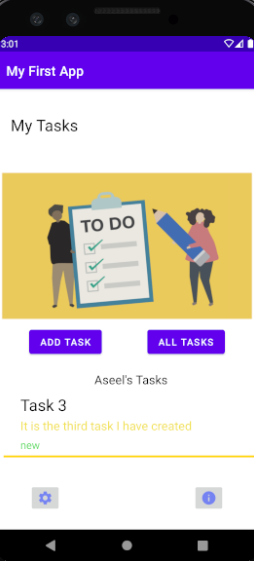
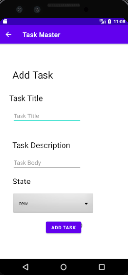

# taskmaster

This is an Android app related to tasks.

In this app, we have three activities:
* Main Activity: it has two buttons( Add Task and All Tasks) to allow the user moving throw other activities 
For lab 27, we added three buttons with different titles fot tasks. Once the user clicks on the task button, it will start the details activity. 
Also, there is a title for the tasks buttons that is related to the user name. 
 
* Add Task: it allows the user to add a title for the task and the body. Once the user click on submit button, a ***Submitted!*** text view will be shown to the user. 
 
* All Tasks: for now, it has only an image. 
 
* Settings: Allows the user to insert his/her name to show it in the home page. 
 
* Details: By default, it has no description for tasks, but once the user click on the task button in the home page and get to the details activity, a title related to the task and description will be displayed. 
 

