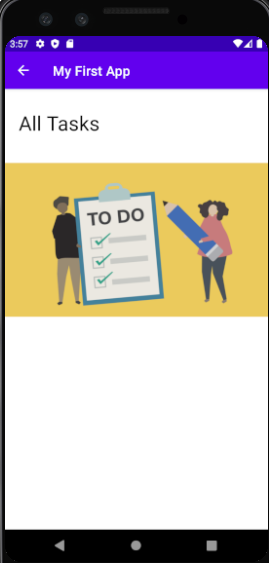

# taskmaster

This is an Android app related to tasks.

In this app, we have three activities:
* Main Activity: it has two buttons( Add Task and All Tasks) to allow the user moving throw other activities

* Add Task: it allows the user to add a title for the task and the body. Once the user click on submit button, a ***Submitted!*** text view will be shown to the user.

* All Tasks: for now, it has only an image.

